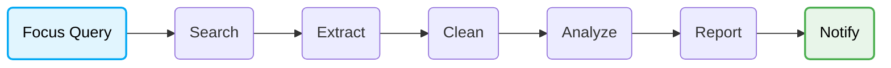
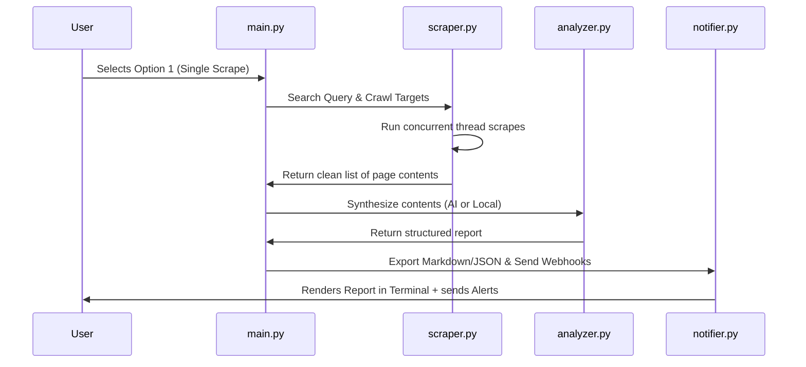

#  Focal Harvest 

### Turn hours of manual web research into a single command.
> **Spend your time evaluating information — not collecting it.**

<!-- Hero Demo GIF Placeholder -->


```text
Python • AI Agent • Web Research • CLI • Zero-Config Offline Fallback
```

---

### Quick Links
[⚙️ How It Works](#-how-it-works) • [📋 Example Output](#-example-output) • [🚀 Features](#-core-features) • [📐 Under The Hood](#-under-the-hood) • [⚡ Quick Start](#-quick-start) • [🛣️ Roadmap](#-roadmap)

---

## 🎯 The Problem

Every developer, researcher, and tech blogger repeats the same tedious manual workflow:

```text
Search Query  ➔  Open 20 Browser Tabs  ➔  Ignore Cookie Ads & SEO Spam  ➔  Copy-Paste Text Fragments  ➔  Synthesize with an LLM  ➔  Repeat Next Week
```

This workflow isn't difficult—it's just repetitive. Focal Harvest automates the entire process, running as a local, lightweight **research pipeline** directly inside your terminal.

---

## ⚙️ How It Works



### Example in Action:
1. **Query**: `"What's new in ROS 2 Jazzy?"`
2. **Search**: The pipeline queries web search engines and fetches relevant developer targets.
3. **Crawl**: Scrapes the pages concurrently in parallel threads to bypass Cloudflare and speed up execution.
4. **Clean**: Stubs out menus, footer widgets, and tracking code, keeping only the core text.
5. **Synthesize**: Passes the clean texts to the synthesis engine to generate a detailed report.
6. **Alert**: Pushes the report to `reports/` and sends summary embeds to your configured Discord/Telegram channels.

<!-- CLI Execution Screenshot Placeholder -->


---

## 🔌 Zero-Config, Offline-First Fallback
Unlike most AI tools that demand heavy local setups or forced API credentials, Focal Harvest works immediately out of the box:
* **No local LLMs or Ollama downloads** (saving gigabytes of disk space).
* **No databases or Docker containers** to run or configure.
* **No GPU required** (runs effortlessly on low-end student laptops).
* **Local Synthesis Fallback**: If you don't provide API keys, it uses a built-in statistical keyword-density position ranker to compile reports offline.
* **Optional AI Providers**: Plug in standard API keys for **Gemini 1.5 Flash**, **GPT-4o-mini**, or **Claude 3.5 Sonnet** to upgrade your summaries.

---

## 📋 Example Output

Here is a real example of the structured Markdown report generated when researching **"Gemini 1.5 Flash vs Gemini 1.5 Pro"**:

<!-- Report Preview Screenshot Placeholder -->


---

## 📊 Manual Research vs. Focal Harvest

| Workflow Step | Manual Research |  Focal Harvest |
| :--- | :--- | :--- |
| **Sourcing Info** | Opening multiple tabs and scanning pages | Automatic query orchestration via API or crawler |
| **Data Cleaning** | Copying text and ignoring ads, headers, and footers | Automatic content sanitization using a **hybrid readability parser** |
| **Information Synthesis** | Copy-pasting fragments into an LLM interface | Streamlined synthesis via Gemini, Claude, OpenAI, or local extractors |
| **Topic Monitoring** | Manually checking pages weekly for updates | Built-in cron-like automation loops with console alerts |
| **Report Generation** | Writing and formatting summaries manually | Instant, structured Markdown & raw JSON exports |
| **Notifications** | Checking yourself | Discord Webhooks and Telegram Bot alerts |

---

## 🚀 Core Features

### 🔍 Research & Crawling
* **Orchestrated Search**: Choose between the AI-optimized Tavily Search API or a lightweight DuckDuckGo crawler fallback.
* **Resilient Request Wrapper**: All HTTP calls flow through a custom wrapper implementing configurable retry limits, exponential backoff, random jitter (to avoid stampeding servers), and fail-fast timeouts on tarpitted connections.
* **Parallel Scraper**: Crawls multiple target URLs concurrently in threads to speed up sweeps.
* **Optional 403 Bypass (`curl_cffi`)**: Native optional support for `curl_cffi`. If installed, the crawler impersonates Google Chrome's TLS/JA3 fingerprints to bypass Akamai and Cloudflare `403 Forbidden` bot-detection gates.

### 🧹 Cleaning & Parsing
* **Wayback Machine Integration**: Automatically redirects protected SPA platforms (like Quora, Reddit, and Stack Overflow) to the Internet Archive to bypass bot firewalls and IP rate limits safely.
* **Hybrid Parser**: Uses `readability-lxml` to extract clean, layout-stripped article content. Automatically falls back to full-soup structural cleaning on directory index pages (like Hacker News or GitHub) to prevent data loss.
* **Local-First Caching**: Scraped pages are saved locally to `reports/cache/` using URL MD5 hashes. Subsequent requests load instantly from disk (bypassing the web completely to save network bandwidth and search credits).
* **Terminal Cache Feedback**: Displays cache status indicators directly in the scraping table (`SUCCESS (CACHED)` in cyan vs `SUCCESS (LIVE)` in green).
* **Anti-Bot Resilience**: Randomizes browser User-Agents and sends standard Google search referrers and Client Hints (`sec-ch-ua`) to mimic natural browser navigation.
* **17+ Built-In Plugins**: Pre-configured scraping modules designed to target major platforms with specific layout cleaning rules:
  * **Hacker News**: Extracts full thread comments and listings.
  * **Reddit**: Bypasses dynamic elements using `.json` endpoint mappings and Wayback fallback comments trees.
  * **Stack Overflow**: Formats code blocks, highlights accepted answers, and filters by score.
  * **GitHub**: Cleans repository files, directory listings, issues, PRs, and discussions.
  * **Academic Databases (arXiv, PubMed, Google Scholar)**: Formats abstracts, citations tables, DOI metadata, and authors metrics.
  * **Blogs & Portals (Medium, Substack, Wikipedia, Quora, Dev.to)**: Sanitizes body prose and strips subscription overlays, edit links, references, and popups.
  * **Finance & Markets (Yahoo Finance, SEC EDGAR)**: Extracts ticker pricing fin-streamers, company filings, and outputs financial tables as Markdown tables (with compliant user agents).
  * **Dev Docs & E-Commerce (ReadTheDocs, Amazon, Product Hunt)**: Strips navigation TOC sidebars, formats product prices/ratings/features lists, and captures top launch comments.

### 🧠 Intelligence & Synthesis
* **Multi-LLM Integrations**: Connects directly to Gemini 1.5 Flash, Claude 3.5 Sonnet, or GPT-4o-mini via REST endpoints.
* **Multi-Provider LLM Failover**: Automatically tries your preferred AI API key and cascades gracefully across backup providers (Gemini ➡️ OpenAI ➡️ Claude) before dropping to the local offline summarizer if a key is invalid or rate-limited.
* **Live Search Grounding**: Leverages Gemini’s search grounding tool to execute real-time web verification within the model.

### ⏱️ Monitoring & Alerts
* **Daemon Automation**: Schedule crawls at custom intervals to continuously monitor search targets.
* **Alert Webhooks**: Automatically dispatches embeds to Discord or Telegram channels when a research sweep completes.

---

## 📐 Under The Hood

### System Architecture


### Folder Layout
```text
├── install.py            # Platform-independent dependency setup wrapper
├── config_manager.py     # Reads and writes config.json
├── scraper.py            # DuckDuckGo/Tavily search, concurrent crawler, HTML parser
├── analyzer.py           # LLM request logic and offline local summarizer
├── notifier.py           # Markdown styling, JSON storage, Discord/Telegram webhooks
├── utils.py              # Resilient safe_request HTTP wrapper with retries
├── main.py               # ASCII visual interface and main loop controller
├── requirements.txt      # Python library dependencies
├── WALKTHROUGH.md        # Step-by-step example execution walkthrough
└── tests/                # Automated unit and mock test suite
```

---

## ⚡ Quick Start

### 1. Install Dependencies
Ensure you have Python 3.12+ installed. Run the platform-independent installer to set up core requirements and automatically attempt optional bypass enhancements (like `curl_cffi`):
```bash
python install.py
```
*(Alternatively, you can run `pip install -r requirements.txt` for a standard manual installation).*

### 2. Launch the Application
Run the interactive CLI controller:
```bash
python main.py
```

### 3. Run Automated Tests
Execute the unit test suite to verify application stability and mock request flows:
```bash
python -m unittest discover -s tests
```

### 4. Check Out the Walkthrough
For a detailed guided tour of the CLI menus using a live example, read the [WALKTHROUGH.md](WALKTHROUGH.md) guide.

---

## 🛠️ Configuration

Focal Harvest can be configured in two ways:
* **Option A (In-App)**: Run `python main.py`, select Option **`3`** (`Configure API Keys & Settings`), and paste your credentials directly. These are saved to a local `config.json`.
* **Option B (Environment Variables)**: Export standard keys (e.g. `GEMINI_API_KEY`, `TAVILY_API_KEY`, `DISCORD_WEBHOOK_URL`) in your terminal session or write them to a local `.env` file.

### ⚙️ Customizable Pipeline Parameters
Once `config.json` is generated, you can fine-tune the request pipeline and cache behavior:
* `"max_retries"`: Maximum retry attempts for failed requests (default: `3`).
* `"backoff_factor"`: Base multiplier for exponential backoff sleep times (default: `1.0`).
* `"retry_on_status_codes"`: Array of HTTP status codes to retry on (default: `[429, 500, 502, 503, 504]`).
* `"cache_enabled"`: Enable/disable local file caching (default: `true`).
* `"cache_expiration_hours"`: Cache age limit before performing a fresh download (default: `24`).

### 💡 Optional: Bypassing Cloudflare/Akamai 403 blocks
If you scrape highly protected e-commerce or documentation portals and hit `403 Forbidden` blocks, you can install the optional C-compiled TLS impersonation library:
```bash
pip install curl_cffi
```
Once installed, Focal Harvest will automatically route requests through `curl_cffi` to mimic Google Chrome's JA3 signatures and connection layouts, bypassing most cloud firewalls.

---

## ⚖️ Design Philosophy
Focal Harvest is built around five non-negotiable boundaries:
1. **Lightweight Footprint**: Small project size that installs quickly.
2. **Strictly CLI/TUI**: Runs completely inside the terminal—no web frontends or background REST daemons.
3. **Low Hardware Requirements**: Runs smoothly on low-end machines without requiring GPUs.
4. **No Local AI Installs**: Avoids multi-gigabyte Ollama/Llama downloads by using fast API integrations and local rule-based ranking.
5. **No SQL Databases**: Stores records in standard, human-readable text files to preserve filesystem transparency.

---

## 🛣️ Roadmap

* [x] Parallel concurrent crawler.
* [x] Hybrid readability text parser.
* [x] Multi-LLM provider endpoints (Gemini, Claude, GPT) with Multi-Provider Failover.
* [x] Live Google search grounding.
* [x] Offline-first summarizer.
* [x] Telegram and Discord integrations.
* [x] Local text-browser history viewer.
* [x] Plugin System: Build hooks for custom parsing modules and 17+ built-in standard plugins.
* [ ] **Incremental Updates**: Only alert or append to reports when new search changes are detected.
* [ ] **PDF/JSON Exporters**: Output reports to PDF or structured CSV fields.

---

## ⚖️ Legal Disclaimer & Responsible Use

Focal Harvest is a local command-line open-source utility designed strictly for personal, academic, and professional **research and educational purposes**. By using this tool, you agree to respect the following boundaries:

1. **Public Data Scraping**: Scraping publicly accessible data (without logging in) is legally protected under established U.S. case law (*hiQ Labs v. LinkedIn*, *Meta v. Bright Data*, and *X Corp. v. Bright Data*). However, some platforms explicitly forbid automated scraping in their Terms of Service (ToS) and may implement blocks.
2. **Logged-In Scraping Warning**: The scraper should not be used with active personal session cookies. Gaining authenticated access via automated scrapers breaches platform ToS and can result in the **immediate suspension or permanent ban** of your accounts. Use burner/research accounts exclusively if authenticating.
3. **Respecting Server Resources**: Always run crawls with polite rate-limiting intervals (such as our default caches and retry backoffs) to respect target server load. Avoid heavy or parallel request volumes that could degrade server performance and constitute a "trespass to chattels."
4. **No Central Database**: All data is cached and stored locally on your filesystem. The maintainers do not collect, transmit, or hold any scraped records. You are solely responsible for ensuring your data collection complies with regional privacy laws (such as GDPR, CCPA, and DPDP) regarding Personally Identifiable Information (PII).

---

## 🤝 Contributing
Contributions are welcome! If you want to add an AI provider, improve parsing rules, or suggest new CLI panels, please feel free to fork the repository and open a Pull Request.

---

If Focal Harvest saves you time during your technical research, consider giving the repository a ⭐. Feedback, issues, and contributions are always welcome.

---

## 📜 License
Distributed under the MIT License. See `LICENSE` for details.
