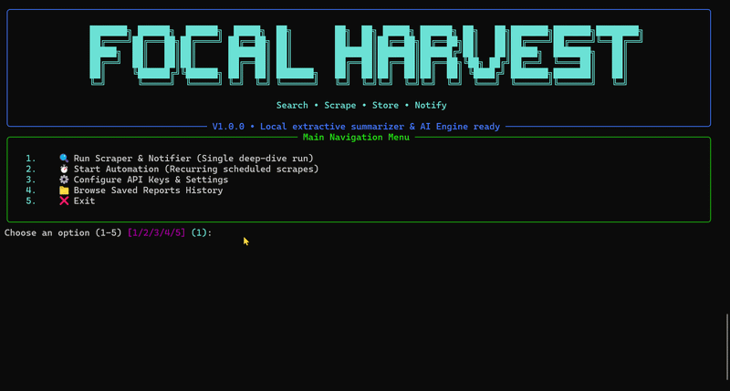
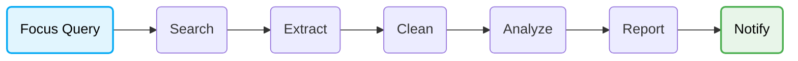
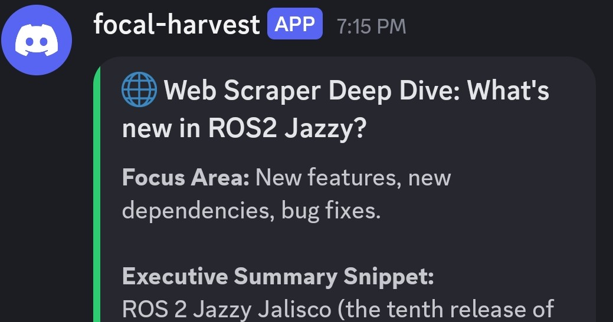
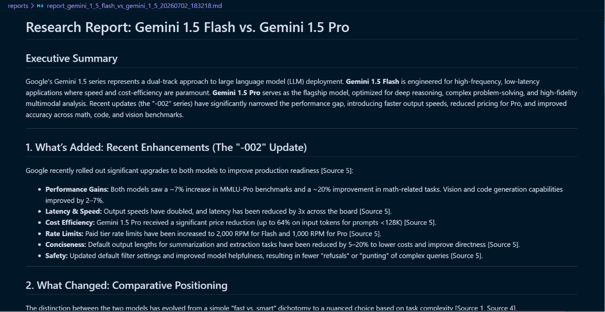
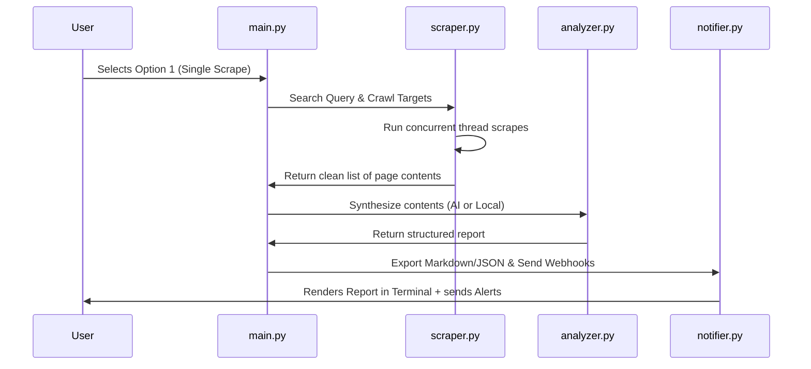

#  Focal Harvest 

### Turn hours of manual web research into a single command.
> **Spend your time evaluating information — not collecting it.**

<!-- Hero Demo GIF Placeholder -->


```text
Python • AI Agent • Web Research • CLI • Zero-Config Offline Fallback
```

---

### Quick Links
[⚙️ How It Works](#-how-it-works) • [📋 Example Output](#-example-output) • [🚀 Features](#-core-features) • [📐 Under The Hood](#-under-the-hood) • [⚡ Quick Start](#-quick-start) • [🛣️ Roadmap](#-roadmap)

---

## 🎯 The Problem

Every developer, researcher, and tech blogger repeats the same tedious manual workflow:

```text
Search Query  ➔  Open 20 Browser Tabs  ➔  Ignore Cookie Ads & SEO Spam  ➔  Copy-Paste Text Fragments  ➔  Synthesize with an LLM  ➔  Repeat Next Week
```

This workflow isn't difficult—it's just repetitive. Focal Harvest automates the entire process, running as a local, lightweight **research pipeline** directly inside your terminal.

---

## ⚙️ How It Works



### Example in Action:
1. **Query**: `"What's new in ROS 2 Jazzy?"`
2. **Search**: The pipeline queries web search engines and fetches relevant developer targets.
3. **Crawl**: Scrapes the pages concurrently in parallel threads to bypass Cloudflare and speed up execution.
4. **Clean**: Stubs out menus, footer widgets, and tracking code, keeping only the core text.
5. **Synthesize**: Passes the clean texts to the synthesis engine to generate a detailed report.
6. **Alert**: Pushes the report to `reports/` and sends summary embeds to your configured Discord/Telegram channels.

<!-- CLI Execution Screenshot Placeholder -->


---

## 🔌 Zero-Config, Offline-First Fallback
Unlike most AI tools that demand heavy local setups or forced API credentials, Focal Harvest works immediately out of the box:
* **No local LLMs or Ollama downloads** (saving gigabytes of disk space).
* **No databases or Docker containers** to run or configure.
* **No GPU required** (runs effortlessly on low-end student laptops).
* **Local Synthesis Fallback**: If you don't provide API keys, it uses a built-in statistical keyword-density position ranker to compile reports offline.
* **Optional AI Providers**: Plug in standard API keys for **Gemini 1.5 Flash**, **GPT-4o-mini**, or **Claude 3.5 Sonnet** to upgrade your summaries.

---

## 📋 Example Output

Here is a real example of the structured Markdown report generated when researching **"Gemini 1.5 Flash vs Gemini 1.5 Pro"**:

<!-- Report Preview Screenshot Placeholder -->


---

## 📊 Manual Research vs. Focal Harvest

| Workflow Step | Manual Research | 🌾 Focal Harvest |
| :--- | :--- | :--- |
| **Sourcing Info** | Opening multiple tabs and scanning pages | Automatic query orchestration via API or crawler |
| **Data Cleaning** | Copying text and ignoring ads, headers, and footers | Automatic content sanitization using a **hybrid readability parser** |
| **Information Synthesis** | Copy-pasting fragments into an LLM interface | Streamlined synthesis via Gemini, Claude, OpenAI, or local extractors |
| **Topic Monitoring** | Manually checking pages weekly for updates | Built-in cron-like automation loops with console alerts |
| **Report Generation** | Writing and formatting summaries manually | Instant, structured Markdown & raw JSON exports |
| **Notifications** | Checking yourself | Discord Webhooks and Telegram Bot alerts |

---

## 🚀 Core Features

### 🔍 Research & Crawling
* **Orchestrated Search**: Choose between the AI-optimized Tavily Search API or a lightweight DuckDuckGo crawler fallback.
* **Parallel Scraper**: Crawls multiple target URLs concurrently in threads to bypass anti-bot throttling.

### 🧹 Cleaning & Parsing
* **Hybrid Parser**: Uses `readability-lxml` to extract clean, layout-stripped article content. Automatically falls back to full-soup structural cleaning on directory index pages (like Hacker News or GitHub) to prevent data loss.
* **Anti-Bot Resilience**: Randomizes browser User-Agents and headers to avoid request throttling and `403 Forbidden` failures.

### 🧠 Intelligence & Synthesis
* **Multi-LLM Integrations**: Connects directly to Gemini 1.5 Flash, Claude 3.5 Sonnet, or GPT-4o-mini via REST endpoints.
* **Live Search Grounding**: Leverages Gemini’s search grounding tool to execute real-time web verification within the model.

### ⏱️ Monitoring & Alerts
* **Daemon Automation**: Schedule crawls at custom intervals to continuously monitor search targets.
* **Alert Webhooks**: Automatically dispatches embeds to Discord or Telegram channels when a research sweep completes.

---

## 📐 Under The Hood

### System Architecture


### Folder Layout
```text
├── config_manager.py     # Reads and writes config.json
├── scraper.py            # DuckDuckGo/Tavily search, concurrent crawler, HTML parser
├── analyzer.py           # LLM request logic and offline local summarizer
├── notifier.py           # Markdown styling, JSON storage, Discord/Telegram webhooks
├── main.py               # ASCII visual interface and main loop controller
├── requirements.txt      # Python library dependencies
└── WALKTHROUGH.md        # Step-by-step example execution walkthrough
```

---

## ⚡ Quick Start

### 1. Install Dependencies
Ensure you have Python 3.12+ installed. Clone the repository and run:
```bash
pip install -r requirements.txt
```

### 2. Launch the Application
Run the interactive CLI controller:
```bash
python main.py
```

### 3. Check Out the Walkthrough
For a detailed guided tour of the CLI menus using a live example, read the [WALKTHROUGH.md](WALKTHROUGH.md) guide.

---

## 🛠️ Configuration

Focal Harvest can be configured in two ways:
* **Option A (In-App)**: Run `python main.py`, select Option **`3`** (`Configure API Keys & Settings`), and paste your credentials directly. These are saved to a local `config.json`.
* **Option B (Environment Variables)**: Export standard keys (e.g. `GEMINI_API_KEY`, `TAVILY_API_KEY`, `DISCORD_WEBHOOK_URL`) in your terminal session or write them to a local `.env` file.

---

## ⚖️ Design Philosophy
Focal Harvest is built around five non-negotiable boundaries:
1. **Lightweight Footprint**: Small project size that installs quickly.
2. **Strictly CLI/TUI**: Runs completely inside the terminal—no web frontends or background REST daemons.
3. **Low Hardware Requirements**: Runs smoothly on low-end machines without requiring GPUs.
4. **No Local AI Installs**: Avoids multi-gigabyte Ollama/Llama downloads by using fast API integrations and local rule-based ranking.
5. **No SQL Databases**: Stores records in standard, human-readable text files to preserve filesystem transparency.

---

## 🛣️ Roadmap

* [x] Parallel concurrent crawler.
* [x] Hybrid readability text parser.
* [x] Multi-LLM provider endpoints (Gemini, Claude, GPT).
* [x] Live Google search grounding.
* [x] Offline-first summarizer.
* [x] Telegram and Discord integrations.
* [x] Local text-browser history viewer.
* [ ] **Plugin System**: Build hooks for custom parsing modules.
* [ ] **Incremental Updates**: Only alert or append to reports when new search changes are detected.
* [ ] **PDF/JSON Exporters**: Output reports to PDF or structured CSV fields.

---

## 🤝 Contributing
Contributions are welcome! If you want to add an AI provider, improve parsing rules, or suggest new CLI panels, please feel free to fork the repository and open a Pull Request.

---

If Focal Harvest saves you time during your technical research, consider giving the repository a ⭐. Feedback, issues, and contributions are always welcome.

---

## 📜 License
Distributed under the MIT License. See `LICENSE` for details.
