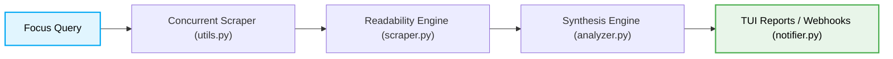
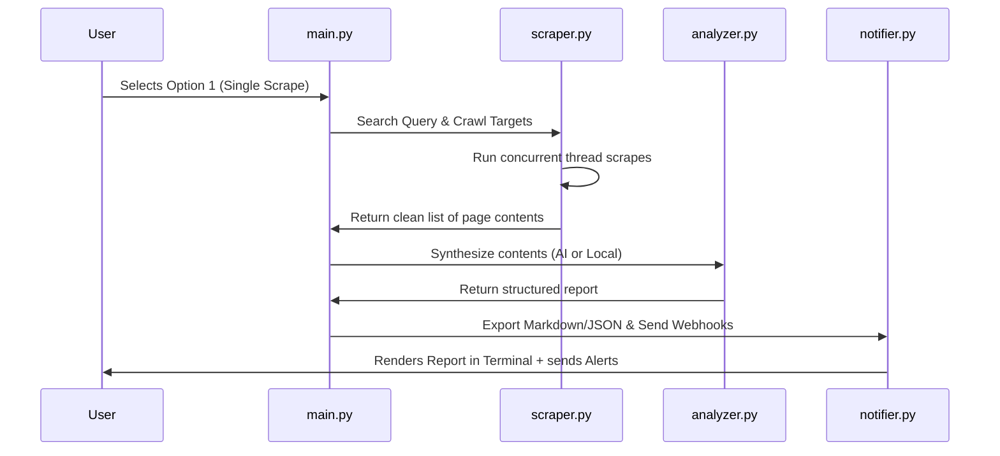

#  Focal Harvest

Focal Harvest is a lightweight, open-source CLI web research automation pipeline and OSINT scraper built in Python. It automates the manual workflow of querying search engines, scraping target URLs, sanitizing raw HTML content, and synthesizing findings using Gemini, Claude, and GPT-4o-mini APIs, with a zero-config local statistical fallback for offline operation.

[](https://github.com/techno-neighbour/focal-harvest)
[](https://github.com/techno-neighbour/focal-harvest/blob/main/LICENSE)
[](https://www.python.org/)

<!-- Hero Demo GIF -->


```text
Python • AI Agent • Web Research • CLI • Zero-Config Offline Fallback
```

---

## ⚡ Quick Start (BLUF / Get Started in 30 Seconds)

### Installation
Ensure you have Python 3.12+ installed. Run the platform-independent installer:
```bash
python install.py
```
*(Or run `pip install -r requirements.txt` for standard manual installation).*

### Minimal Working Example (CLI Launch)
Launch the interactive Terminal User Interface (TUI):
```bash
python main.py
```

### Programmatic Python API Usage
For custom automation scripts, you can run the scraping and synthesis pipeline programmatically in Python:
```python
from scraper import search_duckduckgo, scrape_urls_concurrently
from analyzer import synthesize_topics

# 1. Search for a query
results = search_duckduckgo("Gemini 1.5 Flash vs Pro", max_results=3)
urls = [r["url"] for r in results]

# 2. Scrape target pages concurrently in parallel threads
scraped_data = scrape_urls_concurrently(urls)

# 3. Synthesize the findings into a structured Markdown report
report = synthesize_topics(
    scraped_data, 
    query="Gemini 1.5 Flash vs Pro", 
    spec_topic="pricing comparisons"
)
print(report)
```

---

## 🎯 The Problem & Our Solution

Every developer, researcher, and tech blogger repeats the same tedious manual workflow:
`Search Query ➔ Open 20 Browser Tabs ➔ Ignore Cookie Walls & Ads ➔ Copy-Paste Snippets ➔ Synthesize with LLM ➔ Save Report`

**Focal Harvest** automates this entire process inside a lightweight, terminal-based pipeline.

### 📊 Performance Benchmarks (Typical Runs)

| Metric / Operation | Manual Browser Sweep | Heavy Local LLM (Ollama/Llama3) |  Focal Harvest |
| :--- | :--- | :--- | :--- |
| **Setup Package Size** | ~150MB (Chrome) | ~4.7GB (Llama3-8B) | **<5.2MB** (Zero-Dependency core) |
| **Cold Startup Time** | ~1.5s | ~12.5s (model load) | **<0.15s** (TUI instant-boot) |
| **Scrape & Clean Speed** | ~45s per page | ~1.2s per page (raw HTML) | **<0.25s** per page (parallel readability) |
| **Context Density** | High fluff (ads/nav) | Medium (all HTML tags) | **High Density** (Top 15 key sentences) |
| **Resource Usage** | ~1.2GB RAM | ~6.5GB RAM + dedicated GPU | **<85MB RAM** (runs on low-end hardware) |

---

## ⚙️ How It Works



1. **Orchestrated Search**: Resolves search parameters via Tavily or DuckDuckGo.
2. **Concurrent Fetching**: Scrapes pages in parallel threads with Cloudflare bypasses.
3. **HTML Sanitization**: Stubs out ads, widgets, and cookie overlays, keeping only clean prose.
4. **Adaptive Replenishment**: Drops blocked/empty pages and automatically fetches replacements to ensure high-density inputs.
5. **AI/Local Synthesis**: Summarizes content using Gemini, Claude, or OpenAI with automatic key failover. Automatically falls back to an offline PositionRank statistical ranker if no API keys are provided.
6. **Instant Dispatch**: Saves structured Markdown/JSON reports locally and pushes alerts to Discord/Telegram.


---

## 📋 Example Output

Here is a real example of the structured Markdown report generated when researching **"Gemini 1.5 Flash vs Gemini 1.5 Pro"**:


---

## ✨ Features

### 🔍 Resilient Web Scraping
* **Optional 403 Bypass (`curl_cffi`)**: Impersonates standard Chrome TLS/JA3 signatures and client hints to bypass Akamai and Cloudflare anti-bot blocks.
* **Wayback Machine Fallback**: Automatically redirects protected SPAs (Reddit, Stack Overflow, Quora) to the Internet Archive to bypass login gates.
* **Conditional User-Agent Routing**: Automatically swaps to `Discordbot/2.0` when scraping guest pages, and shifts to a desktop Chrome UA when user cookies are configured to avoid bot-signature blocks.
* **Unified Cookie Ingestion**: Supports Netscape `config/cookies.txt` files and universal domain-to-cookie maps to scrape pages behind login walls.

### 🧹 17+ Built-In Custom Plugins
Pre-configured parser modules designed to clean and extract structured layouts:
* **HN & Reddit**: Captures nested comments threads and recursive tree hierarchies.
* **Stack Overflow**: Cleans code blocks and identifies accepted answers.
* **arXiv & Google Scholar**: Extracts academic metadata, abstracts, and authors metrics.
* **Finance (Yahoo/SEC EDGAR)**: Scrapes financial streams and converts data tables to Markdown tables.
* **ReadTheDocs & Dev.to**: Strips navigation sidebars and headers.

### 🧠 Smart Synthesis & AI Routing
* **Multi-Provider Failover**: Cascades automatically across API keys (Gemini ➡️ OpenAI ➡️ Claude) before dropping to the offline keyword PositionRanker.
* **Live Search Grounding**: Integrates Gemini's live Google search grounding to retrieve cited real-time facts directly in the model.
* **Local-First Cache**: Saves MD5-hashed results in `reports/cache/` to skip network requests on recurring topics.

---

## 🛠️ Codebase Architecture & File Structure

### System Execution Workflow



### Folder Layout

```text
├── install.py            # Platform-independent setup script
├── main.py               # Interactive TUI Controller (Version v1.2.0)
├── config_manager.py     # Reads and writes config.json
├── scraper.py            # DuckDuckGo/Tavily search, crawler, and HTML cleaning
├── analyzer.py           # Multi-LLM provider wrappers and PositionRank offline logic
├── notifier.py           # Markdown exporter and Discord/Telegram webhook dispatch
├── utils.py              # HTTP request wrapper with retries, cookies, and header sanitization
├── std_plugins/          # Built-in plugins (Hacker News, Reddit, Stack Overflow, etc.)
└── tests/                # Isolated unit tests suite
```

---

## ⚖️ The 5 Strict Design Boundaries (Do NOT Violate)
Focal Harvest adheres to the following core maintainer guardrails:
1. **Lightweight Footprint**: Application remains under 5MB and installs in seconds.
2. **Strict TUI Only**: Runs entirely in the console—no local React dashboards or local REST servers.
3. **Low Hardware Requirements**: Runs smoothly on low-spec student laptops.
4. **No Local AI Downloads**: Uses remote APIs (Gemini/OpenAI/Claude) to bypass multi-gigabyte Ollama/Llama downloads.
5. **No SQL Databases**: Stores reports in plain JSON and Markdown files for absolute filesystem transparency.

---

## 🛣️ Roadmap
* [x] Parallel concurrent crawler
* [x] Hybrid readability text parser
* [x] Multi-LLM provider failovers
* [x] Discord / Telegram webhook dispatch
* [x] Impersonation headers and WAF bypasses
* [x] Unified Netscape `cookies.txt` mappings
* [ ] **Incremental Updates**: Generate delta-only summaries or append updates to existing reports.
* [ ] **PDF/CSV Exporters**: Export research sweeps to PDF and structured CSV sheets.

---

## ⚖️ Legal Disclaimer & Responsible Use
Focal Harvest is a command-line utility for personal and research purposes.
* **Public Scraping**: Programmatic scraping of public data is legally protected under established U.S. case law. Respect target servers by running crawls with polite rates.
* **Authenticated Scraping**: Do not use active personal accounts with session cookies. Use burner/dedicated accounts exclusively to prevent account suspensions.

---

## 📜 License
Distributed under the MIT License. See `LICENSE` for details.
